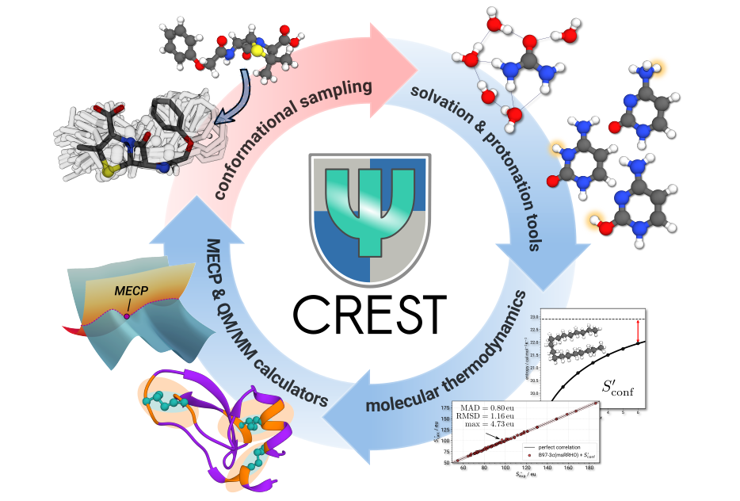

<h1 align="center">CREST</h1>
<h3 align="center">Conformer-Rotamer Ensemble Sampling Tool</h3>
<div align="center">

[](https://github.com/crest-lab/crest/releases/latest)
[](https://anaconda.org/conda-forge/crest)
[](http://dx.doi.org/10.1039/c9cp06869d)
[](https://doi.org/10.1063/5.0197592)

[](https://www.gnu.org/licenses/lgpl-3.0)
[](https://crest-lab.github.io/crest-docs/)

</div>

CREST (abbreviated from ***C***onformer-***R***otamer ***E***nsemble ***S***ampling ***T***ool) is a program for the automated exploration of the low-energy molecular chemical space.
It functions as an OMP scheduler for calculations with efficient force-field and semiempirical quantum mechanical methods such as xTB, and provides
a variety of capabilities for creation and analysis of structure ensembles.<br> See our recent publication in *J. Chem. Phys.* for a feature overview: [**https://doi.org/10.1063/5.0197592**](https://doi.org/10.1063/5.0197592)

<div align="center">

</div>


## Documentation

The CREST documentation with installation instructions and application examples is hosted at: <br>
<div align="center">

[](https://crest-lab.github.io/crest-docs/)


</div>

## Installation quick guide

There are multiple possible ways of installing CREST. Detailed build instructions can be found at <https://crest-lab.github.io/crest-docs/page/installation>.

> [!WARNING]  
> For any installation make sure that you have correctly installed and sourced the [`xtb`](https://github.com/grimme-lab/xtb) program before attempting any calculations with CREST.
> **While `xtb` is technically not needed for the primary runtypes of CREST versions >3.0 thanks to an integration of [`tblite`](https://github.com/tblite/tblite), some functionalities, like QCG, still require it!**

##

### Option 1: Precompiled binaries 
[](https://github.com/crest-lab/crest/releases/latest)
[](https://github.com/crest-lab/crest/releases)

The *statically linked* binaries can be found at the [release page](https://github.com/crest-lab/crest/releases) of this repository.
The most recent program version is automatically build (both Meson/Intel and CMake/GNU) from the main branch and can be found at the [continous release page](https://github.com/crest-lab/crest/releases/tag/latest), or directly download them here:

[](https://github.com/crest-lab/crest/releases/download/latest/crest-gnu-12-ubuntu-latest.tar.xz)
[](https://github.com/crest-lab/crest/releases/download/latest/crest-intel-2023.1.0-ubuntu-latest.tar.xz)

Simply unpack the binary  and add it to your *PATH* variable.
```bash
tar -xf crest-gnu-12-ubuntu-latest.tar.xz
```
or
```bash
tar -xf crest-intel-2023.1.0-ubuntu-latest.tar.xz
```
The program should be directly executable.

##

### Option 2: Conda
[](https://anaconda.org/conda-forge/crest) 
[](https://anaconda.org/conda-forge/crest)

A [conda-forge](https://github.com/conda-forge) feedstock is maintained at <https://github.com/conda-forge/crest-feedstock>.

Installing CREST from the `conda-forge` channel can be done via:

```
conda install conda-forge::crest
```

The conda-forge distribution is based on a *dynamically linked* CMake/GNU build.
> [!WARNING]
> When using OpenBLAS as shared library backend for the linear algebra in CREST, please set the system variable `export OPENBLAS_NUM_THREADS=1`, as there may be an ugly warning in the concurrent (nested) parallel code parts otherwise. 


##

### Option 3: Compiling from source
<h4>Tested builds</h4>
<!--blank line after HTML-->


Working and tested builds of CREST (mostly on Ubuntu 20.04 LTS):

| Build System | Compiler | Linear Algebra Backend | Build type     | Status     | Note |
|--------------|----------|------------------------|:--------------:|:----------:|:----:|
| CMake 3.30.2 | GNU (gcc 14.1.0)  | [libopenblas 0.3.27](https://anaconda.org/conda-forge/libopenblas) | dynamic | ✅ ||
| CMake 3.30.2 | GNU (gcc 12.3.0)  | [libopenblas-dev](https://packages.debian.org/stable/libdevel/libopenblas-dev) | static  | ✅ | [](https://github.com/crest-lab/crest/releases/download/latest/crest-gnu-12-ubuntu-latest.tar.xz)|
| CMake 3.28.3 | [Intel (`ifort`/`icc` 2021.9.0)](https://www.intel.com/content/www/us/en/developer/tools/oneapi/toolkits.html)   | [MKL static (oneAPI 2023.1)](https://www.intel.com/content/www/us/en/developer/tools/oneapi/onemkl.html) | dynamic | ⚠️  | OpenMP/MKL problem ([#285](https://github.com/crest-lab/crest/issues/285)) |
| Meson 1.2.0 | [Intel (`ifort`/`icx` 2023.1.0)](https://www.intel.com/content/www/us/en/developer/tools/oneapi/toolkits.html)   | [MKL static (oneAPI 2023.1)](https://www.intel.com/content/www/us/en/developer/tools/oneapi/onemkl.html) | static  | ✅ | [](https://github.com/crest-lab/crest/releases/download/latest/crest-intel-2023.1.0-ubuntu-latest.tar.xz) |


Generally, subprojects should be initialized for the *default* build options, which can be done by 
```bash
git submodule init
git submodule update
```
For more information about builds including subprojects see [here](./subprojects/README.md).

Some basic build instructions can be found in the following dropdown tabs:


<details open>
<summary><h4><code>CMake</code> build</h4></summary>
<!-- blank line to recover markdown format-->

Building CREST with CMake works with the following chain of commands (in this example with `gfortran/gcc` compilers):
```bash
export FC=gfortran CC=gcc
cmake -B _build
```
and then to build the CREST binary
```bash
make -C _build
```
*Optionally*, the build can be tested via
```bash
make test -C _build
```
The `CMake` build typically requires access to shared libraries of LAPACK and OpenMP. They must be present in the library paths at compile and runtime.
Alternatively, a static build can be selected by using `-DSTATICBUILD=true` in the CMake setup step. The current static build with GNU compilers is available from the [**continous release page**](https://github.com/crest-lab/crest/releases/tag/latest). 
</details>

<details>
<summary><h4><code>meson</code> build</h4></summary>
<!-- blank line to recover markdown format-->

For the setup an configuration of meson see also the [meson setup](https://github.com/grimme-lab/xtb/blob/master/meson/README.adoc) page hosted at the `xtb` repository.
The chain of commands to build CREST with meson is:

```bash
export FC=ifort CC=icc
meson setup _build --prefix=$PWD/_dist
meson install -C _build
```

The `meson` build of CREST is mainly focused on and tested with the Intel `ifort`/`icc` compilers.
When using newer versions of Intel's oneAPI, replacing `icc` with `icx` should work. Please refrain from using `ifx` instead of `ifort`, however.
When attempting to build with `gfortran` and `gcc`, add `-Dla_backend=mkl` to the meson setup command. Compatibility with the GNU compilers might be limited. We recommend the CMake build (see the corresponding section) in this instance.

By default the `meson` build will create a **statically** linked binary.
</details>


---

### Citations

1. P. Pracht, F. Bohle, S. Grimme, *Phys. Chem. Chem. Phys.*, **2020**, 22, 7169-7192.
  DOI: [10.1039/C9CP06869D](https://dx.doi.org/10.1039/C9CP06869D)

2. S. Grimme, *J. Chem. Theory Comput.*, **2019**, 155, 2847-2862.
  DOI: [10.1021/acs.jctc.9b00143](https://dx.doi.org/10.1021/acs.jctc.9b00143)

3. P. Pracht, S. Grimme, *Chem. Sci.*, **2021**, 12, 6551-6568.
  DOI: [10.1039/d1sc00621e](https://dx.doi.org/10.1039/d1sc00621e)

4. P. Pracht, C.A. Bauer, S. Grimme, *J. Comput. Chem.*, **2017**, *38*, 2618-2631. 
  DOI: [10.1002/jcc.24922](https://dx.doi.org/10.1002/jcc.24922)

5. S. Spicher, C. Plett, P. Pracht, A. Hansen, S. Grimme,  *J. Chem. Theory Comput.*, **2022**,
  *18*, 3174-3189. DOI: [10.1021/acs.jctc.2c00239](https://dx.doi.org/10.1021/acs.jctc.2c00239)

6. P. Pracht, C. Bannwarth, *J. Chem. Theory Comput.*, **2022**, *18 (10)*, 6370-6385. DOI: [10.1021/acs.jctc.2c00578](https://dx.doi.org/10.1021/acs.jctc.2c00578)

7. P. Pracht, S. Grimme, C. Bannwarth, F. Bohle, S. Ehlert, G. Feldmann, J. Gorges, M. Müller, T. Neudecker, C. Plett, S. Spicher, P. Steinbach, P. Wesołowski, F. Zeller, *J. Chem. Phys.*, **2024**, *160*, 114110. DOI: [10.1063/5.0197592](https://doi.org/10.1063/5.0197592)

<details>
<summary><h4>BibTex entries</h4></summary>
<!-- blank line to recover markdown format-->

```
@article{Pracht2020,
  author ="Pracht, Philipp and Bohle, Fabian and Grimme, Stefan",
  title  ="Automated exploration of the low-energy chemical space with fast quantum chemical methods",
  journal  ="Phys. Chem. Chem. Phys.",
  year  ="2020",
  volume  ="22",
  issue  ="14",
  pages  ="7169-7192",
  doi  ="10.1039/C9CP06869D"
}

@article{Grimme2019,
  author = {Grimme, Stefan},
  title = {Exploration of Chemical Compound, Conformer, and Reaction Space with Meta-Dynamics Simulations Based on Tight-Binding Quantum Chemical Calculations},
  journal = {J. Chem. Theory Comput.},
  volume = {15},
  number = {5},
  pages = {2847-2862},
  year = {2019},
  doi = {10.1021/acs.jctc.9b00143}
}

@article{Pracht2021,
  author ="Pracht, Philipp and Grimme, Stefan",
  title  ="Calculation of absolute molecular entropies and heat capacities made simple",
  journal  ="Chem. Sci.",
  year  ="2021",
  volume  ="12",
  issue  ="19",
  pages  ="6551-6568",
  doi  ="10.1039/D1SC00621E",
  url  ="http://dx.doi.org/10.1039/D1SC00621E"
}

@article{Pracht2017,
  author = {Pracht, Philipp and Bauer, Christoph Alexander and Grimme, Stefan},
  title = {Automated and efficient quantum chemical determination and energetic ranking of molecular protonation sites},
  journal = {J. Comput. Chem.},
  volume = {38},
  number = {30},
  pages = {2618-2631},
  doi = {https://doi.org/10.1002/jcc.24922},
  url = {https://onlinelibrary.wiley.com/doi/abs/10.1002/jcc.24922},
  year = {2017}
}

@article{Spicher2022,
  author = {Spicher, Sebastian and Plett, Christoph and Pracht, Philipp and Hansen, Andreas and Grimme, Stefan},
  title = {Automated Molecular Cluster Growing for Explicit Solvation by Efficient Force Field and Tight Binding Methods},
  journal = {J. Chem. Theory Comput.},
  volume = {18},
  number = {5},
  pages = {3174-3189},
  year = {2022},
  doi = {10.1021/acs.jctc.2c00239}
}

@article{Pracht2022,
  author = {Pracht, Philipp and Bannwarth, Christoph},
  title = {Fast Screening of Minimum Energy Crossing Points with Semiempirical Tight-Binding Methods},
  journal = {J. Chem. Theory Comput.},
  volume = {18},
  number = {10},
  pages = {6370-6385},
  year = {2022},
  doi = {10.1021/acs.jctc.2c00578}
}

@article{Pracht2024,
  author = {Pracht, Philipp and Grimme, Stefan and Bannwarth, Christoph and Bohle, Fabian and Ehlert, Sebastian and Feldmann, Gereon and Gorges, Johannes and M\"uller, Marcel and Neudecker, Tim and Plett, Christoph and Spicher, Sebastian and Steinbach, Pit and Weso\{}lowski, Patryk A. and Zeller, Felix},
  title = "{CREST - A program for the exploration of low-energy molecular chemical space}",
  journal = {J. Chem. Phys.},
  volume = {160},
  number = {11},
  pages = {114110},
  year = {2024},
  month = {03},
  issn = {0021-9606},
  doi = {10.1063/5.0197592},
  url = {https://doi.org/10.1063/5.0197592}
}
```
</details>


### License

CREST is free software: you can redistribute it and/or modify it under the terms of the GNU Lesser General Public License as published by the Free Software Foundation, either version 3 of the License, or (at your option) any later version.

CREST is distributed in the hope that it will be useful, but without any warranty; without even the implied warranty of merchantability or fitness for a particular purpose. See the GNU Lesser General Public License for more details.

Unless you explicitly state otherwise, any contribution intentionally submitted for inclusion in CREST by you, as defined in the GNU Lesser General Public license, shall be licensed as above, without any additional terms or conditions
